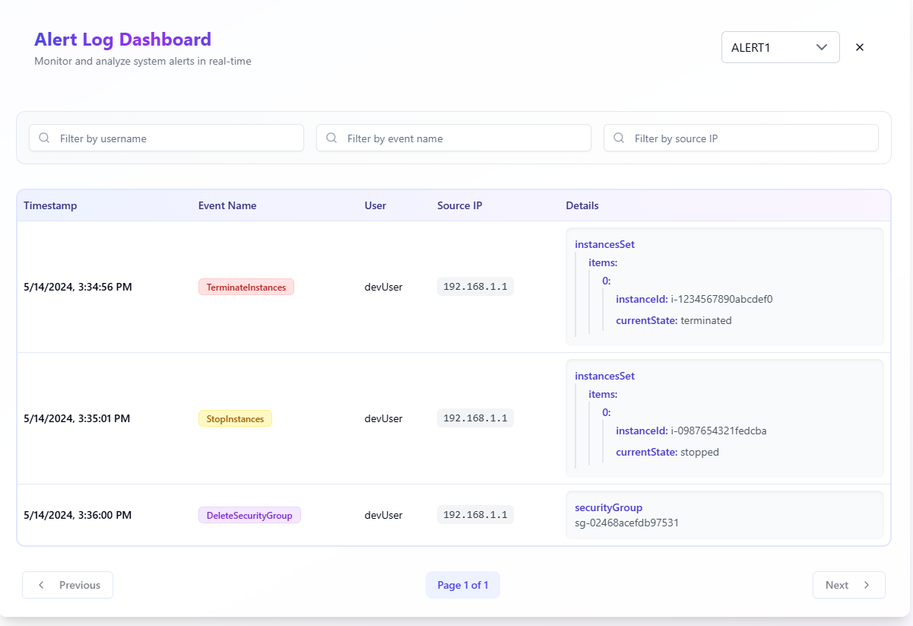

# Alert Log Dashboard

responsive dashboard for monitoring and analyzing system alerts built with Next.js and TypeScript. 



## Tech Stack   

### Core Technologies
- **Next.js 14** 
- **TypeScript**
- **Tailwind CSS**

### UI Components
- **shadcn/ui** - nice components
- **Lucide React** - Icon library


## Project Structure

```
src/
├── app/
│   ├── api/
│   │   └── logs/
│   │       └── route.ts        # API endpoint for logs
│   ├── layout.tsx              # Root layout
│   ├── page.tsx               # Main page component
│   └── globals.css            # Global styles
├── components/
│   ├── ui/                    # shadcn components
│   │   ├── button.tsx
│   │   ├── card.tsx
│   │   ├── input.tsx
│   │   ├── table.tsx
│   │   └── ...
│   └── dashboard/
│       ├── alert-selector/    # Alert selection component
│       ├── log-filters/       # Log filtering component
│       ├── log-table/         # Log display component
│       ├── pagination/        # Pagination component
│       └── index.tsx          # Main dashboard component
├── hooks/
│   └── use-logs.ts           # Custom hook for fetching logs
├── lib/
│   └── utils.ts              # Utility functions
└── types/
    └── logs.ts               # TypeScript interfaces
```

## Getting Started

### Prerequisites
- Node.js 18+ 
- npm or yarn

### Installation

1. Clone the repository:
```bash
git clone 
cd alert-log-dashboard
```

2. Install dependencies:
```bash
npm install
```

3. Install required shadcn/ui components:
```bash
npx shadcn-ui@latest init
npx shadcn-ui@latest add button card input table badge command popover
```

4. Start the development server:
```bash
npm run dev
```

Visit `http://localhost:3000` to see the dashboard.